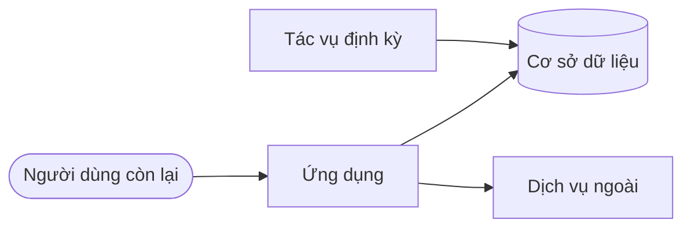

# Tài liệu <Tên dự án> (đang ngừng)

> Trạng thái: Đang áp dụng · Cập nhật: YYYY-MM-DD · Liên quan: [README repo](../README.md), [Kế hoạch ngừng](plan/roadmap.md), [Mục lục ADR](adr/README.md)

<!--
Hồ sơ RETIRING: hệ thống vẫn chạy nhưng đã có quyết định ngừng. Bộ tài liệu này phục vụ ba việc:
(1) vận hành an toàn tới ngày gỡ, (2) gỡ không sót thứ gì, (3) để lại hồ sơ đủ trả lời câu hỏi sau này.
Không mô tả tính năng mới. Nếu dự án đã có tài liệu cũ, giữ nguyên chúng và chỉ thêm các file còn thiếu.
-->

## Tóm tắt

| Câu hỏi | Trả lời |
|---|---|
| Hệ thống làm gì | <một câu> |
| Vì sao ngừng | <một câu>; quyết định ở ADR NNNN (thêm link khi đã viết) |
| Thay bằng gì | <hệ thống thay thế, hoặc "không thay"> |
| Ngày đóng băng tính năng | YYYY-MM-DD |
| Ngày gỡ dự kiến | YYYY-MM-DD |
| Người phụ trách | <tên hoặc vai trò> |
| Bản sao lưu cuối nằm ở đâu | <vị trí mô tả chung; không ghi bí mật hay đường dẫn nhạy cảm> |
| Tiến độ gỡ | [Kế hoạch ngừng](plan/roadmap.md), mục "Theo dõi" |

## Ảnh chụp hệ thống

<!-- Ô architecture/ARCHITECTURE.md, rút gọn thành ảnh chụp tại một ngày. Đủ để người khác biết cái gì đang chạy, phụ thuộc vào gì, và gỡ ở bước nào của kế hoạch ngừng. Tách thành docs/architecture/ARCHITECTURE.md khi quá ~80 dòng. -->

Tính tới YYYY-MM-DD:

| Thành phần | Chạy ở đâu | Phụ thuộc | Ai còn dùng | Gỡ ở giai đoạn |
|---|---|---|---|---|
| *Ví dụ:* ứng dụng web | <máy chủ hoặc dịch vụ> | cơ sở dữ liệu | <người dùng, hệ thống khác> | R3 |
| *Ví dụ:* tác vụ sao lưu đêm | <nơi chạy> | cơ sở dữ liệu | vận hành | R4 (sau sao lưu cuối) |

## Bản đồ tài liệu

| Câu hỏi | Nơi trả lời |
|---|---|
| Gỡ theo thứ tự nào, tới đâu rồi? | [plan/roadmap.md](plan/roadmap.md) (kế hoạch ngừng) |
| Deploy, rollback thế nào tới ngày gỡ? | [ops/deployment.md](ops/deployment.md) |
| Sự cố thì làm gì? | [Runbook](ops/runbooks/README.md) |
| Cấu hình và bí mật nào cần thu hồi? | [dev/configuration.md](dev/configuration.md) |
| Vì sao ngừng, vì sao từng chọn vậy? | [Mục lục ADR](adr/README.md) |
| Sự cố đã xảy ra và bài học | [Postmortem](ops/postmortems/README.md) |

## Quy ước

- Văn xuôi tiếng Việt; tên file, định danh, lệnh, commit message tiếng Anh. Không emoji.
- Đầu mỗi file: `# Tiêu đề` rồi dòng metadata `> Trạng thái: … · Cập nhật: YYYY-MM-DD · Liên quan: …`.
- Trạng thái: **Nháp** · **Đề xuất** · **Đang áp dụng** · **Đã thay thế** (có tài liệu mới thay) · **Lưu trữ** (thứ nó mô tả đã ngừng; chỉ để đọc lại). Sau khi gỡ xong, mọi file chuyển sang Lưu trữ.
- Chưa biết thì ghi `[CẦN XÁC NHẬN: …]`; số liệu ghi nguồn và ngày.
- Link tương đối; kiểm bằng `python3 scripts/check-links.py .`.
- Không secret, token, IP (ngoài loopback), hostname nội bộ, chi tiết lỗ hổng chưa vá, kể cả khi hệ thống sắp gỡ.

## Definition of Done cho tài liệu

| Khi | Cập nhật |
|---|---|
| Xong một bước gỡ | Tick trong [kế hoạch ngừng](plan/roadmap.md), ghi ngày và bằng chứng; sửa cột "Gỡ ở giai đoạn" ở [Ảnh chụp hệ thống](#ảnh-chụp-hệ-thống) |
| Thu hồi một bí mật hoặc tài khoản | [dev/configuration.md](dev/configuration.md) (đánh dấu đã thu hồi, ngày) |
| Đổi cách deploy hoặc tắt một môi trường | [ops/deployment.md](ops/deployment.md), runbook liên quan |
| Quyết định mới (hoãn ngày gỡ, giữ lại một phần) | ADR mới từ [mẫu](adr/0000-template.md); [mục lục ADR](adr/README.md) |
| Có sự cố | Postmortem từ [mẫu](ops/postmortems/000-template.md) |
| Mọi thay đổi tài liệu | Ngày `Cập nhật`; `check-links.py` sạch; không secret |

## Quy tắc tách file

Một mục ở trên được tách thành file riêng, đúng ô của khung, khi dài quá khoảng 80 dòng hoặc tài liệu khác cần link tới nó. Chép file mẫu từ bộ khuôn, chuyển nội dung sang, để lại một câu tóm tắt và link.

## Sau khi gỡ xong

1. Mọi file trong `docs/` chuyển trạng thái sang **Lưu trữ**; dòng đầu mỗi file ghi ngày gỡ.
2. README ở gốc repo ghi rõ "Đã gỡ ngày YYYY-MM-DD" và nơi giữ bản sao lưu cuối.
3. Repo chuyển sang chỉ đọc (archive), không xoá, để lịch sử quyết định còn tra được.
