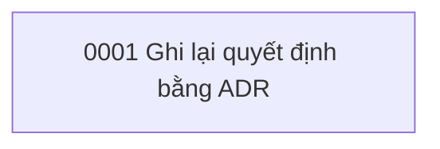
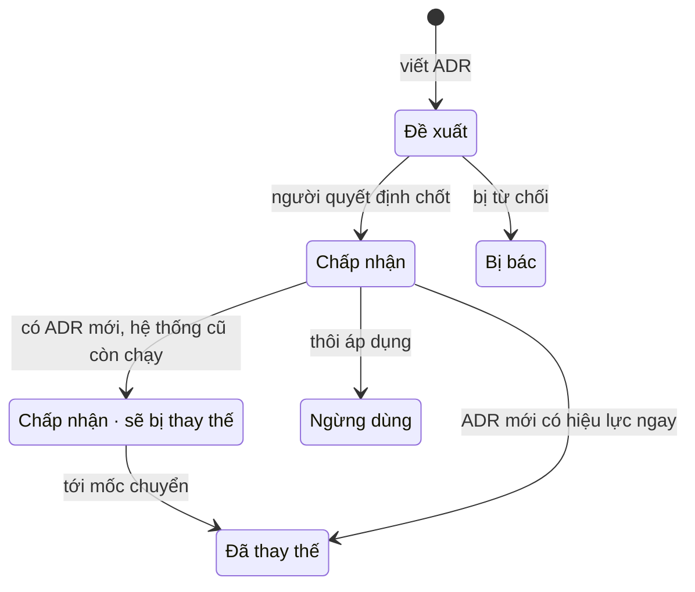

# Sổ quyết định kiến trúc (ADR)

> Trạng thái: Đang áp dụng · Cập nhật: YYYY-MM-DD · Liên quan: [Mẫu ADR](0000-template.md), [ADR 0001](0001-record-architecture-decisions.md), [Tài liệu](../README.md)

<!-- Mục lục và quy tắc của thư mục adr/. Mỗi ADR mới thêm một dòng vào bảng mục 1. -->

Thư mục này ghi **vì sao** hệ thống có hình dạng như hiện nay: mỗi quyết định quan trọng là một file ngắn, đánh số, có trạng thái, có các phương án đã bị loại và có bằng chứng. Code cho biết hệ thống làm gì; ADR cho biết vì sao nó làm thế và cái giá phải trả. Lý do dùng ADR và quy tắc gốc: [ADR 0001](0001-record-architecture-decisions.md).

## 1. Mục lục

| Số | Tiêu đề | Trạng thái | Ngày quyết định | Thay thế / bị thay thế |
|---|---|---|---|---|
| [0000](0000-template.md) | Mẫu ADR | Mẫu (không phải quyết định) | — | — |
| [0001](0001-record-architecture-decisions.md) | Ghi lại quyết định kiến trúc bằng ADR | Chấp nhận | <Ngày tạo> | — |

## 2. Sơ đồ quan hệ

<!-- Tuỳ chọn, nên có khi có trên ~10 ADR hoặc có chuỗi thay thế. Mũi tên "thay thế" đi từ ADR mới tới ADR cũ. -->

## 3. Trạng thái và vòng đời

| Trạng thái ADR | Nghĩa | Dòng metadata `> Trạng thái:` |
|---|---|---|
| Đề xuất | Đã viết, chưa được chốt. Không phải luật | `Đề xuất` |
| Chấp nhận | Đã chốt; code và tài liệu khác phải theo | `Đang áp dụng` |
| Chấp nhận · sẽ bị thay thế | Đã có ADR mới thay nhưng hệ thống cũ còn chạy tới một mốc; vẫn theo khi sửa hệ thống cũ | `Đang áp dụng` (ghi ADR thay thế trong mục "Trạng thái") |
| Đã thay thế | Không còn hiệu lực; ghi số ADR thay thế | `Đã thay thế` |
| Bị bác | Đề xuất bị từ chối; giữ lại để không bàn lại từ đầu | `Lưu trữ` |
| Ngừng dùng | Thôi áp dụng mà không có ADR thay (ví dụ thành phần đã gỡ) | `Lưu trữ` |

## 4. Cách viết một ADR mới

1. Kiểm tra có cần ADR không (mục 5). Chi tiết cài đặt thì ghi vào spec hoặc tài liệu vận hành.
2. Copy khối mẫu trong [0000-template.md](0000-template.md) thành `NNNN-<name>.md`: số tiếp theo (4 chữ số), tên tiếng Anh ASCII kebab-case, ví dụ `0007-use-postgres-job-queue.md`.
3. Điền mọi mục. "Các phương án đã cân nhắc" có ít nhất 2 phương án thật, kể cả "giữ nguyên".
4. Ghi bằng chứng kiểm được: SHA commit, đường dẫn file, số run CI, số liệu có nguồn.
5. Trạng thái ban đầu luôn là `Đề xuất`. Chỉ người có quyền quyết định chuyển sang `Chấp nhận`, kèm ngày.
6. Thêm một dòng vào bảng mục 1 (và mũi tên ở mục 2 nếu có quan hệ).
7. Link ADR từ spec, kế hoạch hoặc runbook liên quan, và ngược lại.
8. Commit message tiếng Anh, ví dụ `docs(adr): add 0007 use postgres job queue` hoặc `docs(adr): supersede 0003 with 0007`.

Quy tắc bắt buộc:

- **Đánh số theo từng repo.** Mỗi repo có dãy số riêng, bắt đầu từ 0001; `0000` luôn là mẫu. Nhắc ADR của repo khác thì ghi tên repo kèm số, ví dụ "ADR 0005 của repo `<repo-khác>`".
- **Một quyết định cho một ADR.** Hai quyết định gắn chặt vẫn tách, rồi link qua lại.
- **Bất biến sau khi chấp nhận.** Không sửa nội dung quyết định; muốn đổi thì viết ADR mới **thay thế** ADR cũ. Ở ADR cũ chỉ được sửa: dòng trạng thái, mục "Liên quan", mục "Lịch sử thay đổi", link hỏng, lỗi chính tả.
- **Không xoá, không đánh số lại.** ADR bị bác vẫn giữ số.
- **Ghi điều đã biết lúc quyết định.** Điều biết sau này đi vào "Hệ quả" hoặc "Lịch sử thay đổi" kèm ngày.
- **Công khai được.** Không secret, token, IP, hostname nội bộ, chi tiết lỗ hổng chưa vá.
- Chỗ chưa chắc ghi `[CẦN XÁC NHẬN: …]`; ước lượng ghi "ước lượng thô".

## 5. Khi nào cần ADR

| Cần ADR | Không cần ADR (ghi ở chỗ khác) |
|---|---|
| Chọn hoặc bỏ một ngôn ngữ, framework, cơ sở dữ liệu, dịch vụ ngoài | Đổi tên biến, tách hàm, refactor nhỏ |
| Đổi hợp đồng dữ liệu, cấu trúc URL công khai, định dạng API | Thêm một trường không đổi hợp đồng: `architecture/data-model.md` |
| Đổi đường deploy, ranh giới bảo mật, cách giữ bí mật | Chỉnh bước vận hành: [runbook](../ops/runbooks/README.md) |
| Quyết định khó đảo ngược hoặc tốn hơn một ngày để đảo ngược | Chỉnh giao diện trong phạm vi đã chọn: `dev/design-system.md` |
| Thêm vào phạm vi một mục đang nằm ở "Không làm" của đặc tả sản phẩm | Thứ tự làm việc: [lộ trình](../plan/roadmap.md) |

Mỗi mốc kết thúc bằng câu hỏi: "Mốc này có quyết định nào chưa thành ADR, hoặc ADR nào cần đổi trạng thái không?"
