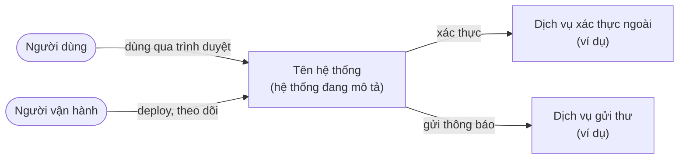
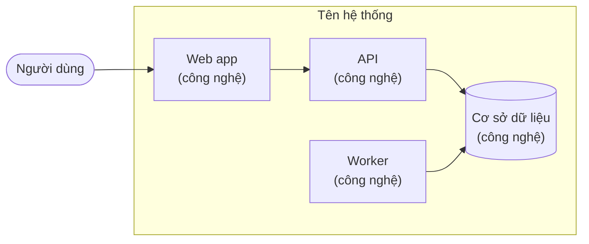
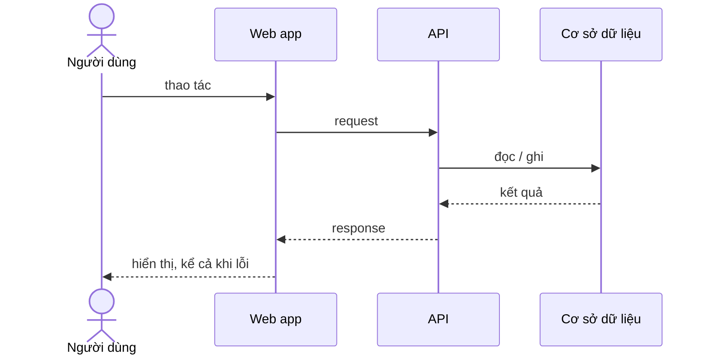

# Kiến trúc <Tên dự án>

> Trạng thái: Nháp · Cập nhật: YYYY-MM-DD · Liên quan: [Đặc tả sản phẩm](../product/spec.md), [Yêu cầu phi chức năng](../product/nfr.md), [Sơ đồ](diagrams/README.md), [Mục lục ADR](../adr/README.md), [Triển khai](../ops/deployment.md), [Mô hình đe doạ](../security/threat-model.md)

<!--
File này trả lời: hệ thống gồm những phần nào, chúng nói chuyện với nhau ra sao, chạy ở đâu, và ranh giới nằm đâu.
Mức chi tiết: đủ để một người mới vẽ lại được sơ đồ và biết sửa ở đâu. Chi tiết dữ liệu, endpoint, cấu hình
nằm ở file riêng và chỉ được link từ đây, không chép lại. Lý do của từng lựa chọn nằm ở ADR.
Chưa có code thì ghi rõ "đề xuất" và đánh dấu [CẦN XÁC NHẬN: …] ở chỗ chưa chốt.
-->

## 1. Tóm tắt

<!-- Bảng hỏi đáp: 5–8 câu mà người mới hay hỏi nhất. -->

| Câu hỏi | Trả lời |
|---|---|
| Có mấy tiến trình chạy lâu? | <…> |
| Dữ liệu nằm ở đâu? | <…> (chi tiết: `architecture/data-model.md` nếu có) |
| Người dùng đi vào từ đâu? | <…> |
| Cái gì xảy ra khi <thao tác chính>? | <…> (luồng ở mục 4) |
| Hỏng thành phần nào thì người dùng thấy gì? | <…> |
| Deploy thế nào? | <…> ([Triển khai](../ops/deployment.md)) |

## 2. Sơ đồ ngữ cảnh (C4 mức 1)

<!-- Hệ thống là một hộp; xung quanh là người dùng và hệ thống ngoài. Quy ước vẽ: diagrams/README.md. -->



## 3. Thành phần (C4 mức 2)

<!-- Mỗi thứ chạy riêng hoặc lưu dữ liệu riêng là một thành phần: ứng dụng, worker, cơ sở dữ liệu, hàng đợi, CDN, lưu trữ file. -->



| Thành phần | Công nghệ | Trách nhiệm | Chạy ở đâu | Dữ liệu sở hữu | ADR |
|---|---|---|---|---|---|
| *Ví dụ:* API | <ngôn ngữ, framework, phiên bản> | Xác thực, nghiệp vụ, ghi dữ liệu | <container, máy, dịch vụ> | Bảng nghiệp vụ | NNNN |
| <…> | <…> | <…> | <…> | <…> | <…> |

### 3.1 Ranh giới giữa các phần

<!-- Ai được gọi ai, ai không được. Ví dụ: "worker không gọi API qua HTTP, chỉ đọc hàng đợi"; "gói giao diện không import gói truy cập dữ liệu". Ranh giới nào có test hoặc lint chặn thì ghi. -->

- <quy tắc ranh giới>, kiểm bằng <lint, test, review>

## 4. Các luồng chính

<!-- 2–5 luồng quan trọng nhất. Luồng có nhiều bước hoặc dễ hỏng thì vẽ sequence. -->

### 4.1 <Tên luồng>



Khi hỏng ở từng bước: <điều người dùng thấy, điều được ghi log, cảnh báo>.

## 5. Dữ liệu (tóm tắt)

<!-- Vài dòng: thực thể chính, nguồn sự thật, nơi lưu, sao lưu. Chi tiết ở architecture/data-model.md (nếu có). -->

- <…>

## 6. Môi trường

| Môi trường | Mục đích | Chạy ở đâu | Dữ liệu | Tên riêng (project, cổng) |
|---|---|---|---|---|
| dev | Phát triển trên máy | Máy dev, `127.0.0.1` | Dữ liệu mẫu | <tên tường minh, không dùng mặc định> |
| CI | Kiểm tra mỗi PR | <dịch vụ CI> | Tạo mới mỗi lần chạy | <…> |
| prod | Người dùng thật | <…> | Thật | <…> |

Quy tắc: mỗi môi trường có tên riêng tường minh; chỗ nào dùng tên hoặc giá trị mặc định thì hai môi trường có thể đè lên nhau.

## 7. Triển khai

Tóm tắt một đoạn; chi tiết ở [Triển khai](../ops/deployment.md).

## 8. Bảo mật (tóm tắt)

Ranh giới tin cậy và lớp bảo vệ chính; chi tiết ở [Mô hình đe doạ](../security/threat-model.md).

## 9. Cấu trúc thư mục repo

```text
<repo>/
├── <thư mục>/        <chứa gì>
├── docs/             tài liệu (bắt đầu từ docs/README.md)
└── scripts/          script tiện ích (kiểm link tài liệu, ...)
```

## 10. Công nghệ và phiên bản

| Thành phần | Công nghệ | Phiên bản | Ghim bằng | ADR |
|---|---|---|---|---|
| <…> | <…> | <…> | <lockfile, digest image> | NNNN |

## 11. Kiểm thử theo tầng

Tóm tắt; chi tiết và lệnh ở [Kiểm thử](../dev/testing.md).

## 12. Ràng buộc và đánh đổi đã biết

<!-- Điều hệ thống cố ý không làm tốt, giới hạn đã chấp nhận, nợ kỹ thuật lớn. Mỗi mục link tới ADR hoặc việc trong kế hoạch. -->

- <…>

## 13. Câu hỏi mở

- [CẦN XÁC NHẬN: <câu hỏi>]
