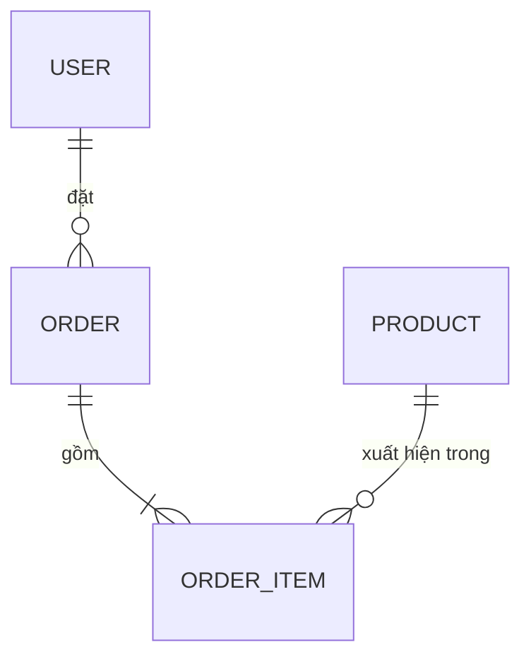
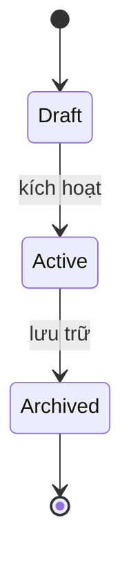

# Mô hình dữ liệu

> Trạng thái: Nháp · Cập nhật: YYYY-MM-DD · Liên quan: [Kiến trúc](ARCHITECTURE.md), [API](../api/api.md), [Đặc tả sản phẩm](../product/spec.md), [Mục lục ADR](../adr/README.md)

<!--
File này trả lời: dữ liệu có hình dạng gì, bất biến nào không được phá, và dữ liệu đổi trạng thái ra sao.
Nguồn sự thật là schema trong code (ví dụ file schema của ORM, migration); file này giải thích điều schema không nói:
ý nghĩa, bất biến, vòng đời, lý do. Tên thực thể, trường, enum dùng NGUYÊN VĂN như trong code.
Spec và API trỏ về đây, không định nghĩa lại dữ liệu.
-->

## 1. Phạm vi và nguồn sự thật

| Hạng mục | Giá trị |
|---|---|
| Cơ sở dữ liệu | <loại, phiên bản> |
| Schema nằm ở | `<đường dẫn file schema trong repo>` |
| Migration | `<công cụ>`; chỉ thêm migration mới, không sửa migration đã chạy ở môi trường thật |
| Lưu ngoài cơ sở dữ liệu | <file, object storage, cache> |

## 2. Nguyên tắc thiết kế

<!-- Ví dụ: id dạng gì; thời gian lưu UTC; xoá mềm hay cứng; dữ liệu riêng tư tách bảng; chuẩn hoá chuỗi Unicode (NFC). -->

1. <nguyên tắc>, vì <lý do hoặc ADR>

## 3. Sơ đồ quan hệ

*Ví dụ: thay bằng thực thể của dự án.*

## 4. Quy ước chung

| Quy ước | Giá trị |
|---|---|
| Khoá chính | <kiểu, cách sinh> |
| Thời gian | <`createdAt`, `updatedAt`, UTC> |
| Xoá | <mềm (`deletedAt`) hay cứng; khi nào> |
| Đặt tên | <bảng số ít hay số nhiều, camelCase hay snake_case> |

## 5. Thực thể chi tiết

### 5.1 <Thực thể>

<Một câu: thực thể này là gì, ai tạo, ai đọc.>

| Trường | Kiểu | Bắt buộc | Mặc định | Ràng buộc | Ghi chú |
|---|---|---|---|---|---|
| `id` | <…> | có | sinh tự động | khoá chính | |
| <…> | <…> | <…> | <…> | <unique, check, khoá ngoại> | <…> |

## 6. Trường dẫn xuất

<!-- Giá trị tính từ trường khác (đếm, tổng, trạng thái hiển thị): tính ở đâu, khi nào, có lưu không. -->

| Trường | Tính từ | Tính ở đâu | Lưu hay tính lại |
|---|---|---|---|
| <…> | <…> | <…> | <…> |

## 7. Bất biến

<!-- Điều luôn phải đúng, bất kể đường ghi nào. Mỗi bất biến có mã I-NN và ít nhất một test; spec chạm vào bất biến phải có tiêu chí nghiệm thu cho nó. -->

| Mã | Bất biến | Giữ bằng | Test |
|---|---|---|---|
| I-01 | *Ví dụ:* một đơn hàng đã thanh toán không đổi được tổng tiền | Ràng buộc ở tầng nghiệp vụ + trigger | <tên test> |
| I-02 | <…> | <…> | <…> |

## 8. Vòng đời trạng thái

| Chuyển | Ai hoặc gì gây ra | Điều kiện | Ghi dấu vết |
|---|---|---|---|
| Draft → Active | <…> | <…> | <sự kiện audit> |

## 9. Chỉ mục và kích thước

| Bảng | Chỉ mục | Phục vụ truy vấn | Kích thước dự kiến (ước lượng thô) |
|---|---|---|---|
| <…> | <…> | <…> | <…> |

## 10. Migration và dữ liệu khởi tạo

- Cách tạo migration mới: `<lệnh>`; đọc SQL sinh ra trước khi áp.
- Migration phá dữ liệu (xoá cột, đổi kiểu) cần: <quy trình, ví dụ hai bước và bản sao lưu trước khi chạy>.
- Dữ liệu khởi tạo (seed): <gồm gì, chạy thế nào, không chứa dữ liệu thật>.

## 11. Câu hỏi mở

- [CẦN XÁC NHẬN: <câu hỏi>]
