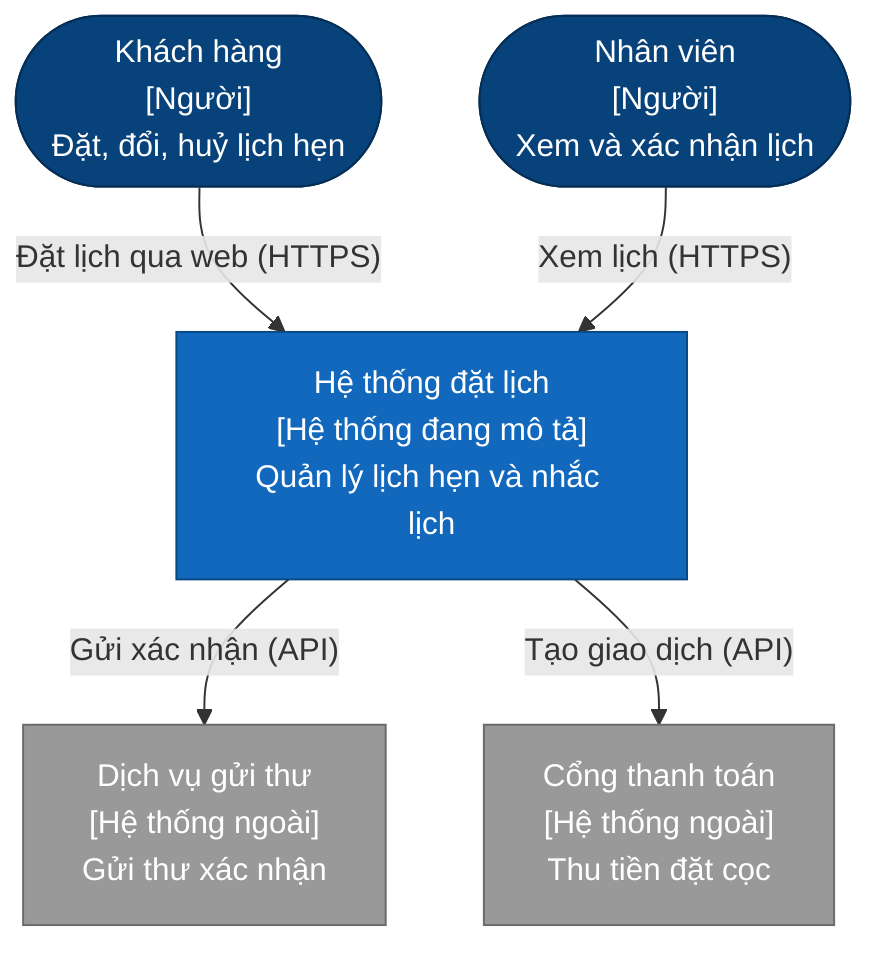
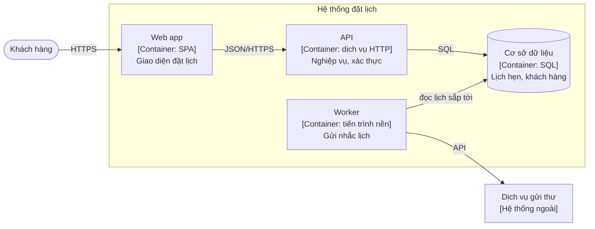

# Sơ đồ

> Trạng thái: Nháp · Cập nhật: YYYY-MM-DD · Liên quan: [Kiến trúc](../ARCHITECTURE.md), [Tài liệu](../../README.md)

<!--
Thư mục này chứa sơ đồ dùng chung cho nhiều tài liệu, và quy ước vẽ.
Sơ đồ chỉ dùng trong một tài liệu thì để ngay trong tài liệu đó.
Sơ đồ trình bày (ảnh, HTML xuất từ công cụ vẽ) cho bài viết hay slide có thể để ở đây, nhưng nguồn chỉnh sửa được
(Mermaid) vẫn là bản gốc cho tài liệu.
-->

## 1. Quy ước

- **Mermaid trong Markdown** là mặc định: sửa được bằng tay, review được trong diff, GitHub hiển thị trực tiếp.
- **Theo mức C4:** mức 1 ngữ cảnh (hệ thống và thế giới xung quanh), mức 2 thành phần (container: thứ chạy riêng hoặc lưu dữ liệu riêng), mức 3 bên trong một thành phần (chỉ khi cần). Mức 4 (code) không vẽ.
- **Mỗi sơ đồ một câu hỏi.** Tiêu đề nói sơ đồ trả lời câu hỏi gì; có dòng "tính tới YYYY-MM-DD".
- **Nhãn trên mũi tên** ghi hành động hoặc giao thức ("gọi HTTPS", "ghi file"); hướng mũi tên là hướng của lời gọi.
- **Đặt tên file** `NN-<name>.md` (hai chữ số, tiếng Anh, kebab-case), ví dụ `01-context.md`, `02-containers.md`.
- **Công khai được:** không IP, hostname nội bộ, tên tài khoản, đường dẫn máy chủ thật.

## 2. Mục lục

| File | Mức | Trả lời câu hỏi | Cập nhật |
|---|---|---|---|
| *(chưa có)* | | | |

## 3. Ví dụ: sơ đồ ngữ cảnh kiểu C4 (mức 1)

*Ví dụ: một ứng dụng đặt lịch hẹn. Thay bằng hệ thống của dự án.*

## 4. Ví dụ: sơ đồ thành phần kiểu C4 (mức 2)

Mermaid có cú pháp C4 riêng (`C4Context`, `C4Container`) nhưng vẫn là tính năng thử nghiệm và hiển thị chưa ổn định; dùng `flowchart` như trên kèm nhãn `[Người]`, `[Container: …]`, `[Hệ thống ngoài]` cho chắc.
