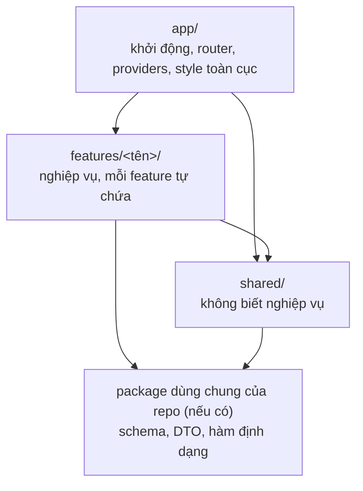

# Cấu trúc front-end

> Trạng thái: Nháp · Cập nhật: YYYY-MM-DD · Liên quan: [Kiến trúc](../architecture/ARCHITECTURE.md), [Hệ thống thiết kế](design-system.md), [Kiểm thử](testing.md), [Cấu hình](configuration.md), [Quy ước API](../api/api.md), [Mục lục ADR](../adr/README.md)

<!--
Chỉ cần khi dự án có ứng dụng giao diện có state (trang quản trị, SPA, app có form và gọi API).
File này trả lời: code giao diện nằm ở đâu, tầng nào được import tầng nào, một tính năng gồm những file gì,
và quy ước đặt tên. Đủ cụ thể để người mới hoặc agent AI biết đặt file mới vào đâu mà không phải hỏi.
Chọn cấu trúc này (hoặc khác đi) là quyết định kiến trúc: ghi một ADR và link ở mục 1.
Thư viện chỉ render (component thuần, sinh HTML tĩnh, không gọi API, không state) không cần cấu trúc feature: xem mục 11.
Ví dụ trong file dùng React + TanStack Query; đổi tên thư viện cho hợp dự án, giữ nguyên luật.
-->

## 1. Phạm vi

| Ứng dụng | Thư mục | Công nghệ | Áp dụng file này |
|---|---|---|---|
| <tên ứng dụng giao diện> | `<đường dẫn, vd apps/web>` | <framework, router, thư viện dữ liệu> | Có |
| <thư viện chỉ render, nếu có> | `<đường dẫn>` | <…> | Không (mục 11) |

Quyết định chọn cấu trúc này: ADR `NNNN` <!-- đổi thành link khi đã có ADR -->.

## 2. Ba tầng và luật phụ thuộc



| Tầng | Chứa | Không chứa |
|---|---|---|
| `app/` | Điểm khởi động, bảng route, providers (dữ liệu, thông báo, error boundary), chặn route khi chưa đăng nhập, style toàn cục | Logic nghiệp vụ; component dùng lại |
| `features/<tên>/` | Mọi thứ của một tính năng: gọi API, mapper, hook, component, page | Thứ mà feature khác cũng cần nhưng không có nghiệp vụ (đưa lên `shared/`) |
| `shared/` | HTTP client, cấu hình môi trường, primitive giao diện, hook và hàm tiện ích không nghiệp vụ | Bất cứ thứ gì biết tên một thực thể nghiệp vụ (bài viết, đơn hàng, người dùng…) |

Luật (vi phạm là lỗi review; L1–L3 kiểm tự động, mục 10):

| # | Luật |
|---|---|
| L1 | Phụ thuộc chỉ đi xuống: `app → features → shared`. `shared` không import `features` hay `app`; `features` không import `app` |
| L2 | Bên ngoài một feature chỉ import qua `features/<tên>/index.ts` (public API). Cấm import sâu vào thư mục con của feature khác |
| L3 | Feature được dùng public API của feature khác, nhưng không được tạo vòng. A và B cần nhau thì tách phần chung thành feature thứ ba, hoặc ghép ở page hay ở `app/` |
| L4 | Kiểu dữ liệu của API (DTO) và schema kiểm tra lấy từ nguồn chung với backend (package dùng chung hoặc sinh từ `api/openapi.yaml`), không định nghĩa lại ở front-end. Front-end chỉ định nghĩa kiểu cho giao diện (view model) |
| L5 | Một thứ chỉ chuyển lên `shared/` khi ít nhất hai feature dùng và nó không chứa nghiệp vụ. Trước đó nó nằm trong feature |
| L6 | Chỉ tạo thư mục con khi có file. Không tạo thư mục rỗng "cho đủ bộ" |

## 3. Cây thư mục

<!-- Thay tên feature bằng feature thật; xoá dòng không dùng. Danh sách feature đầy đủ ở mục 7. -->

```text
<ứng-dụng>/
├── index.html
├── <file cấu hình bundler>
├── e2e/                          test đầu-cuối (trình duyệt thật)
└── src/
    ├── main.tsx                  chỉ gọi app/
    ├── app/
    │   ├── app.tsx               providers
    │   ├── router.tsx            bảng route → page của từng feature (lazy import)
    │   ├── route-guards.tsx      chặn route theo phiên đăng nhập, quyền
    │   └── styles/               token (xem design-system.md), CSS toàn cục
    ├── features/
    │   ├── <feature-nhỏ>/        vd auth: api/, pages/, components/, index.ts
    │   └── <feature-lớn>/        vd editor: đủ các ô ở mục 4 khi cần
    └── shared/
        ├── api/                  http.ts, api-error.ts, query-client.ts
        ├── config/               env.ts, paths.ts, constants.ts
        ├── components/           primitive giao diện (button, dialog, tabs, toast, app-shell)
        ├── hooks/                hook không nghiệp vụ (use-debounce, use-hotkey)
        └── utils/                hàm thuần không nghiệp vụ (cn, assert-never)
```

## 4. Bộ khung của một feature

Mọi feature dùng chung một **bộ khung được phép**; theo L6, chỉ ô nào có file mới được tạo.

| Ô | Vai trò | Có khi |
|---|---|---|
| `api/` | Hàm gọi endpoint, query key, hook đọc và ghi dữ liệu server (`useXxxQuery`, `useXxxMutation`) | Feature gọi API |
| `mappers/` | Hàm thuần chuyển DTO thành view model, và giá trị form thành body request | DTO khác hình dạng giao diện cần (gộp bản dịch, đổi chuỗi ngày thành `Date`, tính nhãn) |
| `hooks/` | Logic giao diện của feature (tự lưu, điều hướng bàn phím, đếm ngược) | Logic dài hơn vài dòng, hoặc dùng ở nhiều component |
| `components/` | Component có nghiệp vụ của feature | Hầu như luôn có |
| `pages/` | Màn gắn với route; ghép component và hook | Feature có route riêng |
| `utils/` | Hàm thuần chỉ feature này dùng | Có hàm thuần không phải mapper |
| `types.ts` | View model, kiểu props dùng chung trong feature | Có kiểu dùng ở nhiều file |
| `constants.ts` | Hằng số của feature | Có hằng số dùng ở nhiều file |
| `index.ts` | Public API: page cho router, component và hook mà feature khác được dùng | Luôn có |

*Ví dụ:* feature đăng nhập ở mốc đầu chỉ có `api/`, `pages/`, `components/`, `index.ts`: dữ liệu trả về dùng thẳng được nên chưa cần `mappers/`; ba màn đều là form đơn giản nên chưa cần `hooks/`. Khi thêm đếm ngược lúc bị khoá tài khoản thì mới tạo `hooks/use-lockout-countdown.ts` và `mappers/auth-error.mapper.ts`.

## 5. Phân vai `api/`, `hooks/`, `mappers/`

| Câu hỏi | Trả lời |
|---|---|
| Hàm gọi endpoint ở đâu? | `features/<tên>/api/` |
| Hook đọc và ghi dữ liệu server (`useQuery`, `useMutation`) ở đâu? | Cũng trong `api/`, cạnh hàm gọi endpoint và query key: mọi thứ chạm server ở một chỗ |
| Hook logic giao diện ở đâu? | `hooks/`; nó dùng hook trong `api/`, không gọi `fetch` trực tiếp |
| Mapper được gọi ở đâu? | Trong `api/`, qua option `select` (đọc) và trước khi gọi mutation (ghi). Component không bao giờ thấy DTO |
| Mapper được làm gì? | Chỉ biến đổi dữ liệu: hàm thuần, không gọi mạng, không đọc state, có unit test |

```text
API ──JSON──► kiểm schema (DTO) ──► mapper ──► view model ──► component
component ──giá trị form──► mapper ──► mutation ──► API
```

*Ví dụ:*

```ts
// features/orders/api/orders.keys.ts
export const orderKeys = {
  all: ['orders'] as const,
  list: (filter: OrderFilter) => [...orderKeys.all, 'list', filter] as const,
}

// features/orders/api/orders.queries.ts
export function useOrdersQuery(filter: OrderFilter) {
  return useQuery({
    queryKey: orderKeys.list(filter),
    queryFn: () => http.get('/api/orders', { query: filter, schema: OrderListDto }),
    select: (dto) => dto.items.map(toOrderRow),
  })
}

// features/orders/mappers/order-row.mapper.ts
export function toOrderRow(dto: OrderDto): OrderRow {
  return { id: dto.id, total: formatMoney(dto.totalCents), placedAt: new Date(dto.placedAt) }
}

// features/orders/index.ts
export { OrdersPage } from './pages/orders-page'
```

## 6. Tầng `shared/`

| Ô | Chứa | Không chứa |
|---|---|---|
| `api/` | HTTP client: gắn header xác thực hoặc CSRF, gửi cookie, chuẩn hoá lỗi theo [Quy ước API](../api/api.md), kiểm schema; cấu hình client dữ liệu (retry, thời gian cache) | Endpoint cụ thể |
| `config/` | Biến môi trường của front-end, kiểm schema lúc khởi động (sai thì app không chạy, xem [Cấu hình](configuration.md)); hàm tạo đường dẫn route; hằng số toàn app | Bí mật (front-end không giữ bí mật) |
| `components/` | Primitive giao diện theo [Hệ thống thiết kế](design-system.md), khung trang | Component biết nghiệp vụ |
| `hooks/` | Hook không nghiệp vụ | Hook gọi API của một thực thể |
| `utils/` | Hàm thuần không nghiệp vụ | Hàm đã có trong package dùng chung của repo (định dạng ngày, slug…): import, không viết lại |

Dấu hiệu `shared/` đang thành bãi rác: file có tên chung chung (`helpers.ts`, `common.ts`, `misc.ts`), hoặc một file chỉ một feature dùng. Khi thấy thì chuyển về feature đó (L5).

## 7. Danh sách feature

<!-- Một hàng mỗi feature. Feature nên trùng với một nhóm spec hoặc một nhóm route. -->

| Feature | Route | Spec | Mốc | Ô đang có |
|---|---|---|---|---|
| `<tên>` | `<…>` | `NNN` | `M#` | `api/`, `pages/`, `components/` |

## 8. Quy ước đặt tên và file

| Chủ đề | Quy ước |
|---|---|
| Tên file | `kebab-case` cho mọi file (`order-row.tsx`); tên component trong code là `PascalCase`. Tránh lỗi phân biệt hoa thường giữa hệ điều hành |
| Hậu tố | `.api.ts`, `.queries.ts`, `.keys.ts`, `.mapper.ts`, `.test.ts(x)` |
| Barrel | Chỉ một `index.ts` mỗi feature; không đặt `index.ts` trong thư mục con |
| Alias | `@/` trỏ tới `src/`; không dùng `../../../` vượt ra ngoài feature |
| Test | Đặt cạnh file được test; test đầu-cuối ở `e2e/` ([Kiểm thử](testing.md)) |

## 9. State, dữ liệu và lỗi

| Loại state | Giữ ở đâu |
|---|---|
| Dữ liệu từ server | <thư viện dữ liệu, vd TanStack Query>; không chép sang state khác |
| State giao diện của một màn | State cục bộ của component, hoặc context trong feature |
| State toàn app (phiên đăng nhập, theme) | <…>; chỉ thêm thư viện state toàn cục khi có lý do ghi trong ADR |
| Form | <thư viện form hoặc state cục bộ>; giá trị form đi qua mapper trước khi gửi |
| Bản nháp chưa gửi | <nếu có: localStorage, IndexedDB; ghi rõ khoá và lúc xoá> |

Lỗi: lỗi API được chuẩn hoá ở `shared/api/`; mỗi page có trạng thái tải, rỗng và lỗi; lỗi không bao giờ bị nuốt im lặng.

## 10. Kiểm tra tự động

<!-- Ghi công cụ thật và lệnh chạy. Ví dụ cấu hình ESLint; đổi đường dẫn cho khớp dự án. -->

| Luật | Công cụ | Lệnh |
|---|---|---|
| L1 | <vd `import/no-restricted-paths` hoặc `eslint-plugin-boundaries`> | `<lệnh lint>` |
| L2 | <vd `no-restricted-imports` với mẫu `@/features/*/*`> | `<lệnh lint>` |
| L3 | <vd `import/no-cycle`> | `<lệnh lint>` |

*Ví dụ:*

```js
'import/no-cycle': 'error',
'import/no-restricted-paths': ['error', { zones: [
  { target: './src/shared', from: './src/features' },
  { target: './src/shared', from: './src/app' },
  { target: './src/features', from: './src/app' },
]}],
'no-restricted-imports': ['error', { patterns: [
  { group: ['@/features/*/*'], message: 'Import qua features/<tên>/index.ts' },
]}],
```

## 11. Khi nào không áp dụng

- **Thư viện chỉ render** (component thuần, sinh HTML tĩnh hoặc email): không gọi API, không state, nên tổ chức theo loại (`pages/`, `layout/`, `components/`) là đủ.
- **Ứng dụng rất nhỏ** (một hai màn): có thể bắt đầu với `app/` + `shared/` + một feature; khi có feature thứ hai thì theo đủ luật.
- Cấu trúc khác (ví dụ Feature-Sliced Design đầy đủ với tầng `entities/`, `widgets/`): ghi ADR và thay file này.

## 12. Câu hỏi mở

- `[CẦN XÁC NHẬN: …]`
