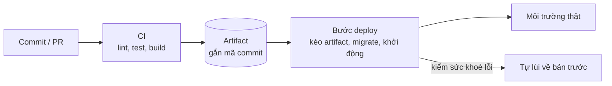

# Triển khai

> Trạng thái: Nháp · Cập nhật: YYYY-MM-DD · Liên quan: [Cấu hình](../dev/configuration.md), [Runbook](runbooks/README.md), [Postmortem](postmortems/README.md), [Mục lục ADR](../adr/README.md), [Lộ trình](../plan/roadmap.md)

<!--
File này trả lời: code đi từ commit tới môi trường thật như thế nào, chạy ở đâu, và lùi lại bằng cách nào.
Ghi lệnh và tên thật (project, dịch vụ, cổng loopback) nhưng KHÔNG ghi bí mật, IP công khai, hostname nội bộ.
Tình huống sự cố cụ thể để ở runbooks/; file này mô tả đường đi bình thường và các kiểu rollback.
Kiến trúc tổng quan: docs/architecture/ARCHITECTURE.md (nếu có). Mô hình đe doạ: docs/security/threat-model.md (nếu có).
-->

## 0. Tóm tắt một trang

| Câu hỏi | Trả lời |
|---|---|
| Artifact là gì | <image container gắn mã commit, gói, binary> |
| Ai kích hoạt deploy | <push nhánh chính, tag, bấm tay> |
| Chạy ở đâu | <nơi chạy, mô tả chung> |
| Deploy mất bao lâu | <…> (tính tới YYYY-MM-DD) |
| Lùi lại thế nào | mục 7 |
| Bí mật nằm ở đâu | [Cấu hình, mục 5](../dev/configuration.md#5-bí-mật-nơi-giữ-xoay-vòng-thu-hồi) |

## 1. Bức tranh tổng thể



## 2. Thành phần chạy ở đâu

| Thành phần | Chạy ở đâu | Quản lý bằng | Cổng (loopback) | Log ở đâu |
|---|---|---|---|---|
| *Ví dụ:* ứng dụng | <container, dịch vụ hệ thống> | <compose, systemd, nền tảng> | `127.0.0.1:3000` | <…> |
| *Ví dụ:* cơ sở dữ liệu | <…> | <…> | không mở ra ngoài | <…> |

## 3. Môi trường

| Môi trường | Kích hoạt | Tên project / dịch vụ | Dữ liệu | Ai truy cập |
|---|---|---|---|---|
| dev | Tay, trên máy | `<tên>-dev` | Mẫu | Người phát triển |
| prod | <…> | `<tên>` | Thật | <…> |

Quy tắc: mỗi môi trường có tên project, thư mục, cơ sở dữ liệu riêng và tường minh; script không dựa vào giá trị mặc định. Thử script deploy trong thư mục tạm hoặc container, không bao giờ trên thư mục thật.

## 4. Build và artifact

- Artifact gắn với mã commit đầy đủ; không deploy bằng nhãn trôi như `latest`.
- Phụ thuộc và image nền ghim phiên bản (lockfile, digest).
- Lệnh build: `<lệnh>`.

## 5. CI

| Job | Chạy khi | Làm gì | Chặn merge |
|---|---|---|---|
| quality | Mỗi PR | Lint, kiểu, test, kiểm link tài liệu | Có |
| build | Nhánh chính | Build artifact, đẩy lên kho | — |
| deploy | Sau build | Mục 6 | — |

Biến và bí mật của CI (chỉ tên): `<TÊN_BÍ_MẬT>`, … ([cấu hình](../dev/configuration.md)).

## 6. Deploy

### 6.1 Trình tự

1. <kéo artifact theo mã commit>
2. <sao lưu cơ sở dữ liệu trước migration (nếu có migration)>
3. <chạy migration>
4. <khởi động bản mới>
5. <kiểm sức khoẻ trong N giây; hỏng thì tự lùi (mục 7)>
6. <ghi kết quả: mã commit, thời gian, `RESULT=…`>

### 6.2 Các bước và cách hỏng

| Bước | Hỏng thì | Hệ thống làm gì | Người làm gì |
|---|---|---|---|
| Kéo artifact | Không tải được | Dừng, giữ bản cũ | Xem [runbook](runbooks/README.md) |
| Migration | Lỗi SQL | Dừng, giữ bản cũ | Runbook khôi phục |
| Kiểm sức khoẻ | Không đạt | Tự lùi về bản trước | Đọc log, sửa, deploy lại |

## 7. Rollback

| Kiểu | Khi nào | Cách làm | Thời gian mục tiêu |
|---|---|---|---|
| Lùi artifact | Bản mới lỗi, dữ liệu chưa đổi hình dạng | `<lệnh rollback> <mã commit>` | <theo OPS ở yêu cầu phi chức năng> |
| Khôi phục dữ liệu | Migration hỏng dữ liệu | Runbook khôi phục | Theo AVAIL (RTO) ở yêu cầu phi chức năng |
| Tắt cờ tính năng | Tính năng mới lỗi | <cách tắt> | <…> |

## 8. Cài đặt lần đầu

```bash
# Ví dụ: các bước dựng môi trường thật lần đầu (thay bằng lệnh thật, không dán bí mật vào đây)
# 1. Tạo thư mục và quyền
# 2. Tạo file cấu hình từ .env.example; sinh bí mật ngay trên máy đích
# 3. Deploy lần đầu và kiểm sức khoẻ
# 4. Bật sao lưu và khôi phục thử
```

## 9. Điều kiện xong phần vận hành theo mốc

| Mốc | Điều kiện |
|---|---|
| M0 | Deploy và rollback chạy thật một lần; sao lưu và khôi phục thử thành công |
| <…> | <…> |

## 10. Câu hỏi mở

- [CẦN XÁC NHẬN: <câu hỏi>]
