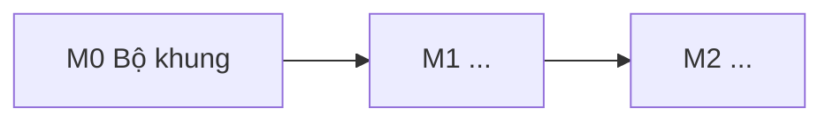

# Lộ trình

> Trạng thái: Nháp · Cập nhật: YYYY-MM-DD · Liên quan: [Đặc tả sản phẩm](../product/spec.md), [Việc sắp làm](tasks.md), [Tiến độ](progress.md), [Mục lục ADR](../adr/README.md)

<!--
Lộ trình trả lời: làm theo thứ tự nào, mỗi mốc gồm gì, và khi nào một mốc được coi là xong.
KHÔNG ghi trạng thái hằng ngày ở đây (thuộc progress.md) và không ghi việc chi tiết (thuộc tasks.md
hoặc specs/NNN-<name>/tasks.md). Mốc chỉ xong khi mọi ô "Điều kiện xong" đã tick và có bằng chứng.
Ước lượng luôn là "ước lượng thô" và ghi đơn vị (ngày công, buổi làm, tuần).
-->

Đơn vị ước lượng: <ngày công / buổi làm / tuần>, <nhịp làm việc, ví dụ 3 buổi mỗi tuần>.

## 1. Bảng tổng

| Mốc | Nội dung | Spec | ADR | Ước lượng thô | Phụ thuộc |
|---|---|---|---|---|---|
| [M0](#m0-bộ-khung-chạy-được) | Bộ khung chạy được: repo, CI, deploy, rollback, sao lưu | — | 0001 | <…> | — |
| [M1](#m1-tên-mốc) | <…> | `001`, `002` | <…> | <…> | M0 |
| **Tổng** | | | | **<…>** | |

## 2. Thứ tự và phụ thuộc

Vì sao thứ tự này:

- <rủi ro lớn nhất làm trước; thứ gì chứng minh được sớm bằng số liệu thật>

## 3. Các mốc

Cấu trúc mỗi mốc: Mục tiêu · Phạm vi · Sản phẩm bàn giao · Điều kiện xong · Ước lượng · Phụ thuộc · Spec và ADR · Rủi ro chính · Ngoài phạm vi mốc · Ghi lại gì.

### M0 Bộ khung chạy được

*Ví dụ mốc đầu nên có ở hầu hết dự án ("walking skeleton"): sửa cho dự án hoặc xoá.*

**Mục tiêu.** Một hệ gần như rỗng nhưng **đi hết đường**: code → CI → artifact theo commit → deploy → rollback → sao lưu, trước khi có tính năng thật.

**Phạm vi.**

1. Repo, lint, format, `.env.example` (chỉ tên biến), tài liệu dựng từ docs-template.
2. Ứng dụng tối thiểu có endpoint kiểm sức khoẻ.
3. CI chạy lint và test; build artifact gắn với commit.
4. Deploy lên môi trường thật và rollback về bản trước.
5. Sao lưu dữ liệu (nếu có) và khôi phục thử.

**Sản phẩm bàn giao.** <…>

**Điều kiện xong.**

- [ ] Push lên nhánh chính → CI xanh → artifact có mã commit.
- [ ] Deploy xong, kiểm từ bên ngoài thấy endpoint sức khoẻ trả OK.
- [ ] Cố ý deploy một bản hỏng → hệ thống tự lùi hoặc lùi tay theo runbook trong thời gian OPS đã đặt.
- [ ] Khôi phục thử bản sao lưu thành công (ghi lệnh và thời gian).
- [ ] Ứng dụng từ chối khởi động khi thiếu cấu hình bắt buộc.

**Ước lượng.** <…> (ước lượng thô).

**Phụ thuộc.** <quyết định cần chốt trước: tên repo, nơi chạy, công nghệ>.

**Spec và ADR.** <…>

**Rủi ro chính.** <…>

**Ngoài phạm vi mốc.** Tính năng nghiệp vụ; giao diện hoàn chỉnh.

**Ghi lại gì.** Thời gian từng bước; lệnh khôi phục đã chạy; lỗi gặp phải nguyên văn.

### M1 <Tên mốc>

**Mục tiêu.** <…>

**Phạm vi.** <…>

**Sản phẩm bàn giao.** <…>

**Điều kiện xong.**

- [ ] <điều kiện kiểm được, có bằng chứng>

**Ước lượng.** <…> (ước lượng thô).

**Phụ thuộc.** M0.

**Spec và ADR.** <…>

**Rủi ro chính.** <…>

**Ngoài phạm vi mốc.** <…>

**Ghi lại gì.** <…>

## 4. Để sau phiên bản đầu

| Việc | Ghi chú |
|---|---|
| <…> | <…> |

## 5. Quy tắc giữ lộ trình

1. **Mốc vượt 50% ước lượng cao** thì dừng, ghi lý do vào [tiến độ](progress.md), cắt phạm vi của mốc (chuyển sang mục 4), rồi mới làm tiếp.
2. **Không thêm việc vào mốc đang làm** mà không bớt việc tương đương.
3. **Mốc chỉ xong khi có bằng chứng** cho từng ô điều kiện xong (commit, run CI, log, ảnh chụp).
4. **Quyết định mới thì viết ADR**; câu hỏi mở đã có câu trả lời thì chuyển vào tài liệu liên quan.
5. **Trạng thái chỉ ghi ở [tiến độ](progress.md)**; bảng ở mục 1 không có cột trạng thái.
