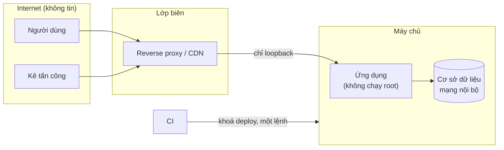

# Mô hình đe doạ

> Trạng thái: Nháp · Cập nhật: YYYY-MM-DD · Liên quan: [Kiến trúc](../architecture/ARCHITECTURE.md), [Yêu cầu phi chức năng](../product/nfr.md), [Cấu hình](../dev/configuration.md), [Triển khai](../ops/deployment.md), [Runbook](../ops/runbooks/README.md)

<!--
File này trả lời: bảo vệ cái gì, trước ai, qua đường nào, lớp nào chặn, và kiểm lớp đó bằng gì.
Tầng T2 khi hệ thống có người dùng, dữ liệu riêng tư hoặc mở ra mạng: làm mục 0–3 và 5.
Tầng T3 cho dự án lớn: làm đủ, rà theo STRIDE, có buổi rà bảo mật trước phát hành (mục 6).
Công khai được: không bí mật, không IP, không chi tiết khai thác được của lỗ hổng chưa vá.
Lớp bảo vệ chưa có phép kiểm thì coi như chưa có.
-->

## 0. Tóm tắt một trang

| Chủ đề | Quyết định | Chi tiết |
|---|---|---|
| Ai được vào phần quản trị | <…> | mục 4 |
| Phiên và xác thực | <…> | mục 4 |
| Dữ liệu đầu vào không tin cậy | <…> | mục 3.3 |
| Bí mật | Sinh tại chỗ, giữ trong kho bí mật, không vào repo hay log | mục 5, [Cấu hình](../dev/configuration.md) |
| Trước phát hành | Rà theo checklist; lỗi mức Cao trở lên phải sửa xong | mục 6 |

## 1. Nguyên tắc

<!-- Ví dụ thường gặp; giữ cái đúng với dự án. -->

1. **Nhiều lớp độc lập.** Không lớp nào là lớp duy nhất; mỗi lớp giả định lớp ngoài có thể đã hỏng.
2. **Hỏng thì đóng.** Thiếu cấu hình bảo mật là lỗi khởi động, không "bỏ qua êm".
3. **Quyền tối thiểu.** Tiến trình, token, khoá chỉ có đúng quyền cần dùng.
4. **Thứ không cần thì không có.** Không mở endpoint, cổng, định dạng upload "để sau dùng".
5. **Kiểm bằng test, không bằng lời hứa.**

## 2. Tài sản cần bảo vệ

| # | Tài sản | Vì sao quan trọng | Nằm ở đâu | Lớp bảo vệ chính |
|---|---|---|---|---|
| TS1 | *Ví dụ:* tài khoản quản trị | Chiếm được là làm được mọi thứ | Cơ sở dữ liệu | Mật khẩu băm + 2FA + giới hạn thử |
| TS2 | *Ví dụ:* dữ liệu cá nhân người dùng | Rò rỉ gây hại cho người dùng và trách nhiệm pháp lý | Cơ sở dữ liệu, bản sao lưu | Phân quyền, mã hoá bản sao lưu |
| TS3 | *Ví dụ:* bí mật vận hành | Mở khoá các tài sản khác | Kho bí mật, biến môi trường | mục 5 |
| TS4 | *Ví dụ:* đường deploy | Chạy code tuỳ ý trên máy chủ | CI, khoá deploy | Khoá chỉ chạy một lệnh, ghim host key |

## 3. Mô hình đe doạ

### 3.1 Tác nhân

| Mã | Tác nhân | Khả năng | Mục tiêu thường gặp |
|---|---|---|---|
| A1 | Bot, scanner trên internet | Quét, dò mật khẩu phổ biến, khai thác lỗ hổng đại trà | Trang đăng nhập, file lộ (`.env`, `.git`) |
| A2 | Kẻ tấn công có chủ đích | Đọc được repo công khai, phishing | Tài khoản quản trị, đường deploy |
| A3 | Chuỗi cung ứng | Gói phụ thuộc, image, action CI bị chèn mã | Build, runtime |
| A4 | Thao tác nhầm (người hoặc agent AI) | Có quyền trong phiên làm việc | Ghi nhầm vào môi trường thật, in bí mật ra màn hình |
| A5 | Sự cố không do người | Hết đĩa, mất máy chủ | Dữ liệu, tính sẵn sàng |

### 3.2 Ranh giới tin cậy

Ranh giới cần giữ:

- **Internet → ứng dụng:** chỉ qua lớp biên; ứng dụng chỉ nghe `127.0.0.1`.
- **Ứng dụng → dữ liệu:** <…>
- **CI → máy chủ:** <…>

### 3.3 Bảng đe doạ

<!-- Rà theo STRIDE: giả mạo (Spoofing), sửa trái phép (Tampering), chối bỏ (Repudiation), lộ thông tin (Information disclosure), từ chối dịch vụ (Denial of service), leo quyền (Elevation of privilege). Mốc là mốc mà lớp chặn phải có và đã được kiểm. -->

| # | Đe doạ | Đường vào | Hậu quả | Lớp chặn | Kiểm bằng | Mốc |
|---|---|---|---|---|---|---|
| T01 | *Ví dụ:* dò mật khẩu quản trị | A1 → trang đăng nhập | Chiếm TS1 | Giới hạn tần suất; khoá sau N lần sai; 2FA | Test tích hợp | M# |
| T02 | *Ví dụ:* XSS lưu trữ qua nội dung người dùng | A2 → trường văn bản | Chiếm phiên | Escape theo ngữ cảnh; CSP không cho script nội dòng | Test với chuỗi độc hại | M# |
| T03 | *Ví dụ:* lộ bí mật qua log | A4 → log CI, log ứng dụng | Mất TS3 | Logger che trường nhạy cảm; quét secret trong CI | Test logger; CI | M# |
| T04 | *Ví dụ:* gói phụ thuộc độc | A3 | Chạy mã khi build | Lockfile; ghim phiên bản; review cập nhật | CI | M# |
| T05 | <…> | <…> | <…> | <…> | <…> | <…> |

## 4. Lớp bảo vệ

| # | Lớp | Chặn đe doạ | Làm ở đâu | Trạng thái |
|---|---|---|---|---|
| L1 | <…> | T01 | <…> | Có / Chưa có / Đề xuất |

## 5. Bí mật

Danh mục bí mật, nơi giữ và cách xoay vòng: [Cấu hình, mục 5](../dev/configuration.md#5-bí-mật-nơi-giữ-xoay-vòng-thu-hồi). Quy tắc khi làm việc với agent AI: không dán giá trị bí mật vào hội thoại; xem tên biến thay vì giá trị.

## 6. Rà bảo mật trước phát hành

- [ ] Mọi đe doạ mức Cao trở lên trong mục 3.3 có lớp chặn đã kiểm.
- [ ] Không có bí mật trong repo và lịch sử git (công cụ quét).
- [ ] Header bảo mật (CSP, HSTS, chống nhúng khung) đã kiểm bằng lệnh thật.
- [ ] Phụ thuộc không có lỗ hổng mức Cao đã biết chưa xử lý.
- [ ] Đã diễn tập khôi phục từ bản sao lưu.
- [ ] Có người thứ hai (hoặc agent kiểm độc lập) rà lại các thay đổi nhạy cảm.

## 7. Rủi ro đã chấp nhận

| Rủi ro | Vì sao chấp nhận | Người chấp nhận | Xem lại khi |
|---|---|---|---|
| <…> | <…> | <…> | <…> |

## 8. Câu hỏi mở

- [CẦN XÁC NHẬN: <câu hỏi>]
