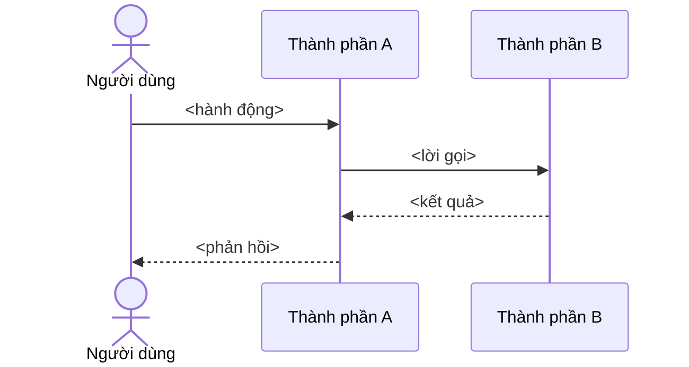

# NNN: <Tên tính năng>, kế hoạch kỹ thuật

> Trạng thái: Đang áp dụng · Cập nhật: YYYY-MM-DD · Liên quan: [spec.md](spec.md), [tasks.md](tasks.md), [Kiến trúc](../../architecture/ARCHITECTURE.md), [ADR NNNN](../../adr/NNNN-<name>.md)

<!-- check-links: template -->

<!--
MẪU. Viết khi mốc chứa spec này bắt đầu. Kế hoạch trả lời: làm THẾ NÀO, theo thứ tự nào, rủi ro gì, lùi lại ra sao.
Quyết định kiến trúc mới phát sinh ở đây → viết ADR riêng rồi link, không chôn quyết định trong plan.
Khi dùng: đổi Trạng thái thành "Nháp", xoá dòng "check-links: template", thay mọi placeholder.
-->

## 1. Tóm tắt cách làm

<3–5 câu: cách tiếp cận chính và vì sao chọn nó thay vì cách khác.>

## 2. Thiết kế

<!-- Thành phần nào đổi, luồng mới hoặc luồng đổi. Luồng nhiều bước thì vẽ sequence. -->

## 3. Thay đổi kéo theo

| Loại | Thay đổi | Tài liệu phải sửa trong cùng PR |
|---|---|---|
| Dữ liệu | <migration, trường mới> | `architecture/data-model.md` |
| API | <endpoint mới hoặc đổi> | `api/openapi.yaml`, `api/api.md` |
| Cấu hình | <biến mới> | `dev/configuration.md`, `.env.example` |
| Vận hành | <bước deploy, runbook> | `ops/deployment.md`, runbook |
| Bảo mật | <bề mặt mới> | `security/threat-model.md` |

## 4. File dự kiến chạm

- `<đường dẫn>`: <thay đổi>

## 5. Thứ tự làm

<!-- Mỗi bước để hệ thống ở trạng thái chạy được; bước rủi ro nhất làm sớm. Chi tiết tick được nằm ở tasks.md. -->

1. <bước>

## 6. Kiểm thử

| Tiêu chí | Test | Loại |
|---|---|---|
| NNN-AC-01 | `<đường dẫn test>` | I |

## 7. Rủi ro và cách lùi

| Rủi ro | Dấu hiệu | Giảm thiểu | Lùi lại thế nào |
|---|---|---|---|
| <…> | <…> | <…> | <rollback, cờ tính năng, migration ngược> |

## 8. Ước lượng

<…> (ước lượng thô), chia theo bước ở mục 5.

## 9. Câu hỏi mở

- [CẦN XÁC NHẬN: <câu hỏi>]
