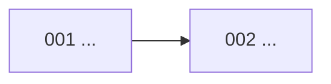

# Đặc tả tính năng

> Trạng thái: Đang áp dụng · Cập nhật: YYYY-MM-DD · Liên quan: [Đặc tả sản phẩm](../product/spec.md), [Lộ trình](../plan/roadmap.md), [Tiến độ](../plan/progress.md), [Mục lục ADR](../adr/README.md), [Mô hình dữ liệu](../architecture/data-model.md), [API](../api/api.md)

<!-- Mục lục và quy tắc của thư mục specs/. Mỗi spec mới thêm một dòng vào bảng mục 1. -->

Mỗi tính năng (hoặc thay đổi đáng kể) là một thư mục `NNN-<name>/` gồm:

| File | Trả lời | Tạo khi |
|---|---|---|
| `spec.md` | Làm gì, cho ai, xong khi nào (tiêu chí nghiệm thu) | Trước khi làm, để thống nhất phạm vi |
| `plan.md` | Làm thế nào về kỹ thuật, theo thứ tự nào, rủi ro gì | Khi mốc chứa spec bắt đầu |
| `tasks.md` | Việc nhỏ có thể tick, mỗi việc gắn với tiêu chí nghiệm thu | Cùng lúc với plan.md |

Mẫu: [000-template/spec.md](000-template/spec.md), [plan.md](000-template/plan.md), [tasks.md](000-template/tasks.md).

## 1. Mục lục

<!-- Cột Tài liệu: trạng thái của spec. Trạng thái hiện thực chỉ ghi ở plan/progress.md. -->

| # | Tính năng | Tóm tắt | Mốc | Tài liệu | ADR |
|---|---|---|---|---|---|
| [000](000-template/spec.md) | Mẫu | Không phải tính năng | — | Mẫu | — |

## 2. Khi nào cần spec

| Cần spec | Không cần spec |
|---|---|
| Hành vi mới mà người dùng thấy | Sửa lỗi nhỏ không đổi hành vi đã đặc tả |
| Thay đổi chạm nhiều thành phần hoặc dữ liệu | Refactor nội bộ |
| Việc cần nhiều hơn khoảng một ngày làm | Việc vận hành một lần (ghi vào runbook hoặc tasks) |

## 3. Cách tạo một spec

1. Copy thư mục `000-template/` thành `NNN-<name>/` (số tiếp theo, 3 chữ số; tên tiếng Anh kebab-case, ví dụ `004-password-reset`).
2. Viết `spec.md` trước. Đổi trạng thái thành `Nháp`, xoá dòng `<!-- check-links: template -->`, thay mọi placeholder.
3. Khi mốc bắt đầu: viết `plan.md` và `tasks.md`.
4. Thêm một dòng vào bảng mục 1 và vào bảng "Theo spec" ở [tiến độ](../plan/progress.md).

## 4. Quy ước

- **Không định nghĩa lại dữ liệu hay API.** Tên thực thể, trường, enum, mã lỗi, endpoint lấy nguyên văn từ [mô hình dữ liệu](../architecture/data-model.md) và [API](../api/api.md). Spec cần thứ chưa có thì ghi "Đề xuất" và sửa tài liệu kia trong cùng PR khi chốt.
- **Tiêu chí nghiệm thu kiểm thử được:** mỗi dòng có đầu vào cụ thể, hành động, kết quả đo được và loại test (ký hiệu ở [Kiểm thử](../dev/testing.md)). Mã dạng `NNN-AC-01`.
- **Không chép số liệu từ mockup** mà không kiểm: mockup thường có dữ liệu giả.
- **Công khai được:** không bí mật, không IP, không dữ liệu người dùng thật.

## 5. Phụ thuộc giữa các spec

<!-- Đọc "A --> B" là "B cần A". Vẽ khi có từ ~5 spec trở lên. -->

