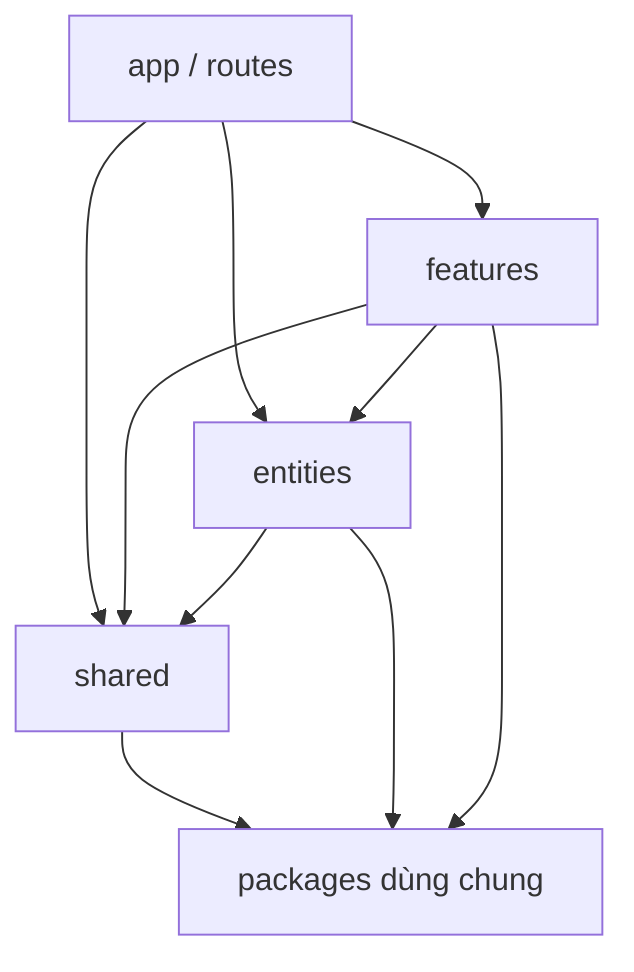

# Frontend Template: Kiến trúc và quy ước dùng lại

> Trạng thái: Template nền tảng · Cập nhật: 2026-10-05
> Phạm vi: Ứng dụng React + TypeScript có state, form, API hoặc routing
> Nguyên tắc: framework và backend là profile lựa chọn; phần lõi không phụ thuộc một project cụ thể.
> Phạm vi triển khai hiện tại: hoàn thiện hai frontend profile `react-spa` và `next-app-router` trước; API profile sẽ gắn sau.

## 1. Mục tiêu

File này mô tả bộ khuôn dùng lại cho các frontend trong tương lai. Nó trả lời:

- File mới phải đặt ở đâu?
- Tầng nào được import tầng nào?
- Một feature được tổ chức thế nào?
- API, server state, client state, form và realtime đi qua đâu?
- Thư viện nào bắt buộc, thư viện nào chỉ cài khi project cần?
- CI phải kiểm tra những gì?

Đây là **architecture template**, không phải source code của một ứng dụng cụ thể. Mỗi project cần có một profile công nghệ và các ADR riêng.

## 2. Phạm vi áp dụng

Áp dụng cho:

- Admin dashboard và CRM.
- CMS và ứng dụng có form/API.
- SPA và ứng dụng web có nhiều feature.
- Dashboard dữ liệu, realtime hoặc phân quyền.

Không bắt buộc áp dụng toàn bộ cho:

- Website tĩnh chỉ có vài trang.
- Component library thuần render.
- Email template.
- Prototype rất nhỏ chỉ có một hoặc hai màn hình.

Project nhỏ có thể bắt đầu với `app/`, một feature và `shared/`. Chỉ tạo thư mục khi có file thật.

## 3. Profile framework

Phần lõi giữ nguyên; chỉ thay profile ở lớp khởi động, routing và rendering.

| Profile | Trạng thái | Dùng khi | Quy ước route |
|---|---|---|---|
| `react-spa` | **Làm trước** | Dashboard, CRM, internal tool, app client-side | Router runtime trong `src/app/router.tsx` hoặc `src/routes/` |
| `next-app-router` | **Làm trước** | SEO, SSR, public web, full-stack Next.js | Route file-system trong `src/app/`; không tạo router trung tâm |
| `react-library` | Để sau | Component library hoặc design system | Không dùng đầy đủ `features/` và API layer |

### 3.1. Phạm vi triển khai theo giai đoạn

Template được triển khai theo thứ tự:

```text
Giai đoạn 1: core + react-spa + next-app-router
Giai đoạn 2: API adapter tRPC hoặc OpenAPI
Giai đoạn 3: extension admin, realtime, analytics, monorepo
```

Trong giai đoạn 1, chưa cần quyết định backend dùng tRPC, OpenAPI, GraphQL hay REST. Frontend core chỉ định nghĩa interface cho `api-client`, `query-client`, `auth` và `realtime`.

Điều này giúp kiểm tra được kiến trúc folder và routing trước khi gắn một backend cụ thể.

Profile phải được ghi trong `docs/architecture/ADR-xxxx-frontend-profile.md`.

Không thiết kế một cây thư mục giả định rằng mọi project đều dùng Next.js. Next App Router là router dựa trên file system và có ranh giới Server Component/Client Component; React SPA lại có router runtime. Hai profile dùng chung feature/domain/shared nhưng không dùng chung cách khai báo route.

### 3.2. Profile `react-spa`

```text
src/
├── app/
│   ├── app.tsx
│   ├── bootstrap.tsx
│   ├── providers.tsx
│   ├── router.tsx
│   └── guards/
│       ├── require-auth.tsx
│       └── require-permission.tsx
│
├── routes/
│   ├── route-config.ts
│   └── lazy-routes.tsx
│
├── features/
├── entities/
└── shared/
```

Đặc điểm:

- App được khởi động từ `main.tsx`.
- Router được tạo bằng code.
- Route lazy-load page/feature khi cần.
- Mọi dữ liệu ban đầu thường được lấy ở client.
- Phù hợp Vite + React Router hoặc router runtime tương đương.
- Không cần SSR hoặc SEO trong profile cơ bản.

Ví dụ route chỉ lắp ghép feature:

```tsx
const router = createBrowserRouter([
  {
    path: '/orders',
    element: <OrdersPage />,
  },
])
```

Feature vẫn độc lập:

```text
features/orders/
├── api/
├── components/
├── hooks/
├── mappers/
└── index.ts
```

### 3.3. Profile `next-app-router`

```text
src/
├── app/
│   ├── (public)/
│   ├── (auth)/
│   ├── (dashboard)/
│   ├── providers.tsx
│   ├── error.tsx
│   ├── loading.tsx
│   └── not-found.tsx
│
├── features/
├── entities/
└── shared/
```

Đặc điểm:

- Route nằm trong `src/app/` theo convention của Next.
- `page.tsx`, `layout.tsx`, `loading.tsx`, `error.tsx` là entrypoint của route.
- Không tạo `router.tsx` trung tâm.
- Mặc định ưu tiên Server Component; chỉ dùng Client Component khi cần state, event hoặc browser API.
- Feature không tự biết URL; route file chịu trách nhiệm kết nối URL với feature.
- API server-only và client-side API phải được tách rõ.

Ví dụ:

```text
src/app/(dashboard)/orders/page.tsx
features/orders/components/orders-page.tsx
```

```tsx
// src/app/(dashboard)/orders/page.tsx
import { OrdersPage } from '@/features/orders'

export default function Page() {
  return <OrdersPage />
}
```

### 3.4. Phần giống nhau giữa hai profile

Cả `react-spa` và `next-app-router` đều dùng chung:

```text
features/
entities/
shared/api/
shared/auth/
shared/config/
shared/realtime/
shared/ui/
shared/testing/
```

Cả hai đều dùng được:

- TanStack Query cho server state.
- React Hook Form + Zod cho form.
- Zustand cho client state nếu thật sự cần.
- MSW cho mock API.
- Playwright cho E2E.
- Cùng import boundary và quy tắc public API.

### 3.5. Không đưa API profile vào giai đoạn 1

`api-trpc` và `api-openapi` không phải hai frontend framework. Chúng là adapter kết nối backend, sẽ được gắn sau khi core frontend đã ổn định.

Trong giai đoạn 1, feature chỉ phụ thuộc vào interface nội bộ:

```text
features/posts/api/
├── posts.keys.ts
├── posts.options.ts
├── posts.queries.ts
└── posts.mutations.ts
```

Sau đó adapter có thể là:

```text
shared/api/adapters/trpc/
```

hoặc:

```text
shared/api/adapters/openapi/
```

Feature không được thay đổi cấu trúc chỉ vì project đổi từ tRPC sang OpenAPI.

## 3.6. Kết quả cần có sau giai đoạn 1

Hai starter phải chạy độc lập với mock API:

```text
starters/
├── react-spa/
│   ├── src/app/
│   ├── src/features/example/
│   ├── src/shared/
│   ├── e2e/
│   └── package.json
└── next-app-router/
    ├── src/app/
    ├── src/features/example/
    ├── src/shared/
    ├── e2e/
    └── package.json
```

Mỗi starter phải có các lệnh chạy được:

```bash
pnpm dev
pnpm lint
pnpm typecheck
pnpm test:run
pnpm test:e2e
pnpm build
```

Feature `example` chỉ để chứng minh template hoạt động; không gắn với blog, fintech hoặc domain cụ thể.

## 4. Cây thư mục cấp repository

### 4.1. Một ứng dụng

```text
project/
├── src/
├── public/
├── e2e/
├── docs/
│   ├── architecture/
│   ├── adr/
│   └── api/
├── package.json
├── tsconfig.json
├── eslint.config.*
├── prettier.config.* hoặc biome.json
├── .env.example
└── README.md
```

### 4.2. Monorepo nhiều ứng dụng

Dùng khi public web, admin hoặc các app khác cần chia sẻ UI, API contract và tooling.

```text
project/
├── apps/
│   ├── web/
│   └── admin/
├── packages/
│   ├── ui/
│   ├── api-contract/
│   ├── api-client/
│   ├── validation/
│   ├── config/
│   ├── eslint-config/
│   ├── tsconfig/
│   └── test-utils/
├── tooling/
├── docs/
├── package.json
├── pnpm-workspace.yaml
└── turbo.json hoặc công cụ tương đương
```

Không chia sẻ business feature giữa các app chỉ vì hai app cùng có màn hình mang tên giống nhau. Chỉ đưa code vào `packages/` khi nó có API ổn định và có ít nhất hai consumer thật.

## 5. Cấu trúc bên trong một app

```text
src/
├── app/
│   ├── providers/
│   ├── layouts/
│   ├── guards/
│   ├── errors/
│   ├── styles/
│   └── bootstrap.tsx
│
├── routes/                    # chỉ dùng cho profile react-spa
│   ├── router.tsx
│   └── route-config.ts
│
├── features/
│   ├── authenticate/
│   ├── manage-users/
│   └── edit-post/
│
├── entities/                  # tùy chọn, chỉ tạo khi domain được dùng lại
│   ├── user/
│   ├── post/
│   └── transaction/
│
└── shared/
    ├── api/
    ├── auth/
    ├── analytics/
    ├── config/
    ├── realtime/
    ├── ui/
    ├── hooks/
    ├── lib/
    ├── types/
    └── testing/
```

Với Next App Router, `src/app/` đồng thời là route tree của framework. Khi đó không tạo thêm `routes/` và route file chỉ làm nhiệm vụ lắp ghép feature:

```text
src/app/
├── (public)/
├── (auth)/
├── (dashboard)/
├── providers.tsx
├── error.tsx
├── loading.tsx
└── not-found.tsx
```

## 6. Luật phụ thuộc



| Mã | Luật |
|---|---|
| L1 | Phụ thuộc chỉ đi xuống: `app/routes → features → entities → shared` |
| L2 | `shared/` không import `entities/`, `features/` hoặc `app/` |
| L3 | `entities/` không import `features/` hoặc `app/` |
| L4 | Feature không import trực tiếp feature khác theo mặc định |
| L5 | Bên ngoài một feature chỉ import qua public API của feature |
| L6 | Không import sâu vào thư mục nội bộ của feature khác |
| L7 | DTO/schema API lấy từ contract chung hoặc generated client; không tự định nghĩa lại |
| L8 | Chỉ đưa code lên `shared/` hoặc `packages/` khi có consumer thật và code không chứa nghiệp vụ cụ thể |
| L9 | Client code không import module server-only; module server-only không đi vào browser bundle |
| L10 | Chỉ tạo thư mục khi có file và có lý do sử dụng |

Nếu hai feature cần nhau, xử lý theo thứ tự:

1. Ghép logic phối hợp ở route/page hoặc `app/`.
2. Nếu là domain model dùng lại, đưa vào `entities/`.
3. Nếu hoàn toàn không nghiệp vụ, đưa vào `shared/`.
4. Không tạo vòng phụ thuộc để tránh tách file.

## 7. Feature contract

Feature đại diện cho một use case hoặc một nhóm hành vi người dùng, không chỉ là một màn hình.

```text
features/edit-post/
├── api/
│   ├── edit-post.keys.ts
│   ├── edit-post.queries.ts
│   ├── edit-post.mutations.ts
│   └── edit-post.api.ts
├── components/
│   ├── post-editor.tsx
│   └── publish-button.tsx
├── hooks/
│   └── use-autosave.ts
├── mappers/
│   ├── post-to-form.mapper.ts
│   └── form-to-command.mapper.ts
├── schemas/
│   └── post-form.schema.ts
├── types.ts
├── constants.ts
└── index.ts
```

Thư mục nào chưa có file thì chưa tạo.

| Thư mục/file | Vai trò |
|---|---|
| `api/` | Endpoint, query key, query options và mutation của feature |
| `components/` | UI biết nghiệp vụ của feature |
| `hooks/` | Logic giao diện có side effect hoặc đủ dài để tách |
| `mappers/` | Hàm thuần đổi DTO ↔ view model/form/command |
| `schemas/` | Validation của form hoặc input ở ranh giới không tin cậy |
| `types.ts` | Kiểu chỉ dùng trong feature |
| `constants.ts` | Hằng số chỉ dùng trong feature |
| `index.ts` | Public API của feature |

Feature không cần có `pages/` trong profile Next. Route file trong `src/app/` import page composition từ feature. Profile React SPA có thể dùng `pages/` nếu router cần page entry riêng.

Ví dụ public API:

```ts
// features/edit-post/index.ts
export { EditPostPanel } from './components/post-editor'
export { useEditPost } from './api/edit-post.queries'
```

Không export toàn bộ file nội bộ chỉ để tiện import.

## 8. Entity layer tùy chọn

`entities/` dành cho domain object ổn định xuất hiện trong nhiều use case:

```text
entities/order/
├── api/
├── model/
├── schemas/
├── mappers/
└── types.ts
```

Ví dụ `order` có thể được dùng bởi:

- `features/create-order`.
- `features/cancel-order`.
- `features/order-history`.
- `features/order-detail`.

Không tạo `entities/` chỉ để chứa mọi model. Nếu một model chỉ phục vụ một use case, giữ nó trong feature đó.

## 9. API architecture

### 9.1. Transport dùng chung

```text
shared/api/
├── http-client.ts
├── api-error.ts
├── query-client.ts
├── auth-transport.ts
├── request-context.ts
└── generated/                 # nếu dùng OpenAPI
```

`shared/api/` xử lý:

- Base URL và environment.
- Timeout và cancellation.
- Cookie/token/CSRF.
- Chuẩn hóa lỗi.
- Request ID.
- Retry có điều kiện.
- Refresh token một lần khi gặp `401`.
- Cấu hình cache mặc định.

Component không gọi `fetch`, `axios` hoặc WebSocket trực tiếp.

### 9.2. API theo feature

```text
features/posts/api/
├── posts.keys.ts
├── posts.options.ts
├── posts.queries.ts
├── posts.mutations.ts
└── posts.api.ts
```

- `*.keys.ts`: query key duy nhất của feature.
- `*.options.ts`: query options dùng chung cho hook, prefetch và hydration.
- `*.queries.ts`: đọc server state.
- `*.mutations.ts`: ghi server state và invalidation.
- `*.api.ts`: request function hoặc adapter tới generated client.

### 9.3. API contract — gắn sau khi hoàn thiện frontend profiles

Phần này thuộc giai đoạn 2. Sau khi `react-spa` và `next-app-router` đã ổn định, chọn **một** profile API cho từng project:

| Profile | Dùng khi |
|---|---|
| `trpc` | Frontend và backend cùng TypeScript, cùng repository hoặc cùng contract runtime |
| `openapi` | Backend độc lập, có nhiều client hoặc cần contract công khai |
| `graphql` | Backend đã chuẩn hóa GraphQL và có nhu cầu query shape linh hoạt |
| `manual-rest` | Prototype hoặc API legacy; phải có kế hoạch nâng cấp |

Không cài tRPC, OpenAPI và GraphQL cùng lúc nếu project không cần.

Với OpenAPI, generated client/model là nguồn chính. Orval là một lựa chọn có thể sinh TypeScript client, React Query integration, schema và mock từ OpenAPI. Nếu backend đã có contract, frontend không tự viết lại DTO.

### 9.4. Các loại dữ liệu

```text
Server DTO → schema validation → mapper → ViewModel → UI
FormValues → form validation → mapper → Command/Request → API
```

Phân biệt rõ:

```ts
type PostDto = ...
type PostViewModel = ...
type PostFormValues = ...
type CreatePostCommand = ...
```

Quy tắc dữ liệu:

- Dữ liệu bên ngoài phải được kiểm tra ở boundary phù hợp.
- View model phục vụ UI, không phải bản sao DTO.
- Tiền dùng integer minor units hoặc decimal string, không dùng `number` cho giá trị cần chính xác.
- Thời gian giữ ISO string/Instant rõ timezone; chỉ tạo `Date` khi thật sự cần thao tác date.
- Mapper là pure function, không gọi mạng và có unit test.

## 10. State management

| Loại state | Nơi lưu mặc định | Quy tắc |
|---|---|---|
| Server state | TanStack Query | Không copy sang Zustand/Redux |
| State cục bộ component | React state | Giữ gần nơi sử dụng |
| UI state dùng qua nhiều vùng | Zustand hoặc Context nhỏ | Chỉ dùng khi có lý do |
| Form state | React Hook Form | Validate bằng schema |
| Filter/pagination có thể chia sẻ | URL search params | URL là nguồn sự thật |
| Draft dài hạn | Storage adapter | Có version và chính sách xóa |
| Realtime | Query cache + realtime adapter | Không tạo bản sao server state |

Thư viện state toàn cục không phải dependency mặc định bắt buộc. Chỉ thêm khi state thực sự vượt qua ranh giới feature hoặc cần workflow phức tạp.

## 11. Auth và permission

```text
shared/auth/
├── session.ts
├── permissions.ts
├── capability.ts
└── auth-client.ts
```

Dùng capability thay vì rải role string:

```ts
can('post.update')
can('transaction.approve')
can('user.invite')
```

Route guard ở frontend chỉ là lớp UX. Backend/API vẫn phải kiểm tra session, tenant, role, permission và resource. Không đặt secret trong client environment hoặc browser bundle.

Cấu hình environment tách rõ:

```text
shared/config/
├── env.client.ts
├── env.server.ts
├── routes.ts
└── constants.ts
```

`env.server.ts` không được import từ module client. Validate environment khi app khởi động; thiếu biến bắt buộc phải fail rõ ràng.

## 12. Realtime

Chỉ thêm khi project thật sự cần dữ liệu đẩy liên tục.

```text
shared/realtime/
├── client.ts
├── connection-manager.ts
├── reconnect.ts
├── auth-refresh.ts
└── event-types.ts

features/orders/realtime/
├── order-events.ts
└── order-subscriptions.ts
```

Luồng chuẩn:

```text
WebSocket/SSE event
→ validate event
→ deduplicate/order event
→ cập nhật hoặc invalidate Query cache
→ UI đọc từ Query
```

Phải có:

- Reconnect và exponential backoff.
- Heartbeat nếu cần.
- Auth refresh.
- Cleanup khi đổi route.
- Event ID/sequence để chống event cũ hoặc trùng.
- Chính sách khi mất kết nối.

Dùng SSE khi chỉ cần server → client. Dùng WebSocket khi cần giao tiếp hai chiều hoặc độ trễ thấp.

## 13. UI và design system

```text
shared/ui/
├── button/
├── dialog/
├── form-field/
├── table/
├── toast/
├── loading-state/
└── error-state/
```

`shared/ui/` chỉ chứa primitive và layout không biết nghiệp vụ. `PostCard`, `OrderStatusBadge` hoặc `TransactionApprovalDialog` thuộc feature/entity phù hợp.

Template cần có:

- Design tokens.
- Typography và spacing.
- Color semantic cho light/dark mode.
- Focus state và keyboard navigation.
- Loading, empty và error state.
- Quy ước responsive.
- Accessibility baseline.

Tailwind, CSS Modules, vanilla-extract hoặc UI framework đều có thể dùng. Chọn một hướng trong profile, không trộn nhiều hệ thống style không có lý do.

## 14. Testing

```text
src/**.test.ts(x)       unit và component/integration
mocks/                  MSW handlers
fixtures/               dữ liệu test
 e2e/                   Playwright browser tests
```

Bộ mặc định cho app stateful:

- Vitest cho unit test.
- Testing Library cho component.
- MSW cho mock API.
- Playwright cho E2E.
- Accessibility test cho component quan trọng.

Mỗi feature mới nên có test cho:

- Mapper.
- Schema/form validation.
- Query/mutation error.
- Loading, empty và error state.
- Permission.
- Luồng chính của người dùng.

E2E không thay thế unit test; unit test cũng không chứng minh routing, cookie, permission và API integration hoạt động cùng nhau.

## 15. Import boundary và CI gate

Có thể dùng ESLint boundary rule, dependency-cruiser hoặc công cụ tương đương. Công cụ phải resolve được TypeScript path alias và relative import.

CI tối thiểu:

```bash
pnpm lint
pnpm typecheck
pnpm test:run
pnpm test:e2e
pnpm build
```

Nếu có generated API:

```bash
pnpm api:generate
pnpm api:check
```

Nếu có rule import boundary, cần có fixture cố tình vi phạm để chứng minh rule thực sự bắt được:

- `shared → features`: fail.
- `feature A → feature B/internal`: fail.
- `feature A → feature B/index`: mặc định fail; nếu project cho phép thì phải ghi ADR.
- `feature → app`: fail.
- Import tương đối vượt boundary: fail.
- Vòng phụ thuộc: fail.

## 16. Package baseline

### Bắt buộc cho app stateful

```text
TypeScript với strict mode
Zod
TanStack Query
React Hook Form
Vitest
Testing Library
MSW
Playwright
ESLint + formatter
```

### Chọn theo profile

| Nhu cầu | Lựa chọn |
|---|---|
| Framework SSR/file-system route | Next.js |
| React SPA | Vite + React Router |
| API cùng TypeScript | tRPC |
| API độc lập | OpenAPI + generated client/Orval |
| Client state | Zustand |
| Table/data grid | TanStack Table hoặc component grid phù hợp |
| Biểu đồ đơn giản | Recharts hoặc thư viện tương đương |
| Biểu đồ dữ liệu lớn | ECharts hoặc thư viện tương đương |
| Money/decimal | Decimal library phù hợp |
| Analytics | Provider adapter, ví dụ GA4 |
| Error monitoring | Sentry hoặc dịch vụ tương đương |
| i18n | Thư viện i18n phù hợp khi có yêu cầu |
| Monorepo | pnpm workspace + Turborepo hoặc công cụ tương đương |

Không cài tất cả thư viện tùy chọn vào mọi project. Template nên có profile hoặc generator để thêm đúng phần cần dùng.

## 17. Scripts chuẩn

```json
{
  "scripts": {
    "dev": "...",
    "build": "...",
    "start": "...",
    "lint": "...",
    "typecheck": "...",
    "test": "...",
    "test:run": "...",
    "test:e2e": "...",
    "api:generate": "...",
    "api:check": "...",
    "check": "pnpm lint && pnpm typecheck && pnpm test:run"
  }
}
```

Pin Node/package manager bằng `.tool-versions`, `.nvmrc` hoặc `packageManager`. Lockfile là bắt buộc. CI và local phải dùng cùng package manager.

## 18. Quy trình tạo feature mới

1. Xác định feature/use case và profile route.
2. Kiểm tra API contract hoặc tạo contract trước.
3. Sinh/cập nhật client nếu dùng OpenAPI.
4. Tạo feature, chưa đưa file vào `shared/`.
5. Thêm schema và mapper ở boundary.
6. Thêm query/mutation vào `features/<name>/api/`.
7. Thêm UI, loading, empty và error state.
8. Thêm permission nếu feature cần quyền.
9. Thêm unit/component/E2E test phù hợp.
10. Chỉ promote code lên `entities/` hoặc `shared/` sau khi có consumer thứ hai.
11. Chạy `pnpm check` và build.
12. Ghi ADR nếu thay đổi luật kiến trúc hoặc thêm dependency nền tảng.

## 19. Những điều không đưa vào template mặc định

- Redux khi chưa có nhu cầu.
- Cả tRPC và OpenAPI trong cùng project.
- Một HTTP client riêng cho từng feature.
- Một global store chứa toàn bộ server data.
- `utils.ts`, `helpers.ts`, `common.ts` không có phạm vi rõ.
- Deep import vào feature khác.
- Secret trong `NEXT_PUBLIC_*`, `VITE_*` hoặc bundle browser.
- Date/number không rõ timezone và độ chính xác.
- Thư mục rỗng chỉ để “đủ cấu trúc”.
- Kubernetes chỉ vì muốn template trông enterprise.

## 20. ADR cần quyết định cho mỗi project

Mỗi project chỉ cần ghi các lựa chọn khác với template:

- Framework profile.
- Router profile.
- API contract: tRPC, OpenAPI, GraphQL hoặc REST.
- Auth/session strategy.
- Client state strategy.
- Design system/UI library.
- Realtime strategy.
- Monorepo hay single app.
- Analytics và error monitoring.
- Browser support và accessibility target.

Template là default có thể thay đổi bằng ADR; không phải luật cứng không thể giải thích.

## 21. Checklist nghiệm thu template

### Kiến trúc

- [ ] Profile framework đã được chọn.
- [ ] Luật import được kiểm tự động.
- [ ] Feature không phụ thuộc vòng.
- [ ] `shared/` không chứa business logic.
- [ ] `entities/` chỉ xuất hiện khi thật sự cần.
- [ ] Module server/client được tách rõ.

### API và state

- [ ] API contract có một nguồn sự thật.
- [ ] DTO, ViewModel, FormValues và Command được phân biệt.
- [ ] Server state đi qua TanStack Query.
- [ ] Query key và invalidation có quy ước.
- [ ] Form có schema và mapper.
- [ ] Timeout, cancellation, retry và error normalization đã được định nghĩa.
- [ ] Realtime có reconnect, ordering và cleanup nếu được bật.

### Chất lượng

- [ ] TypeScript strict.
- [ ] Lint, typecheck, unit, integration và E2E chạy được.
- [ ] API mock không làm sai contract.
- [ ] Build production thành công.
- [ ] Accessibility baseline được kiểm tra.
- [ ] Environment validation fail rõ ràng.

### Khả năng tái sử dụng

- [ ] Không có tên domain cụ thể trong core template.
- [ ] Dependency tùy chọn nằm trong profile.
- [ ] README có lệnh khởi tạo và lệnh kiểm tra.
- [ ] Có một feature mẫu chạy end-to-end.
- [ ] Có ADR cho các lựa chọn khác default.
- [ ] Template được thử trên ít nhất một app nhỏ trước khi mở rộng.

## 22. Kết luận

Bộ khuôn được triển khai theo cấu trúc:

```text
framework-neutral core
+ react-spa profile
+ next-app-router profile
+ API profile gắn sau
+ optional admin/realtime/testing extensions
```

Giai đoạn đầu chỉ cần làm cho hai starter sau chạy ổn định:

```text
react-spa/
next-app-router/
```

Sau khi folder, routing, feature boundary, state, form và testing đã được kiểm chứng ở cả hai starter, mới thêm `api-trpc` hoặc `api-openapi`. Không nên giải quyết frontend framework và backend contract cùng một lúc.

Cấu trúc lõi được khuyến nghị:

```text
app/routes → features → entities → shared → packages
```

Bộ mặc định nên ưu tiên:

```text
TypeScript strict
TanStack Query cho server state
Zustand chỉ khi cần client state dùng chung
React Hook Form + Zod cho form
một API contract duy nhất
Vitest + Testing Library + MSW + Playwright
import boundary + CI gate
```

Mục tiêu của template không phải ép mọi project giống nhau. Mục tiêu là làm cho những quyết định lặp lại trở thành mặc định, còn những khác biệt thật sự được thể hiện rõ bằng profile và ADR.

## 23. Tài liệu tham khảo

- [Next.js App Router](https://nextjs.org/docs/app)
- [TanStack Query React](https://tanstack.com/query/latest/docs/framework/react)
- [React Hook Form](https://react-hook-form.com/docs)
- [Zod](https://zod.dev/)
- [Orval OpenAPI client generation](https://orval.dev/docs/)
- [Vitest](https://vitest.dev/guide/)
- [MSW](https://mswjs.io/docs/)
- [Playwright](https://playwright.dev/docs/intro)
- [TanStack Table](https://tanstack.com/table/latest/docs/overview)
